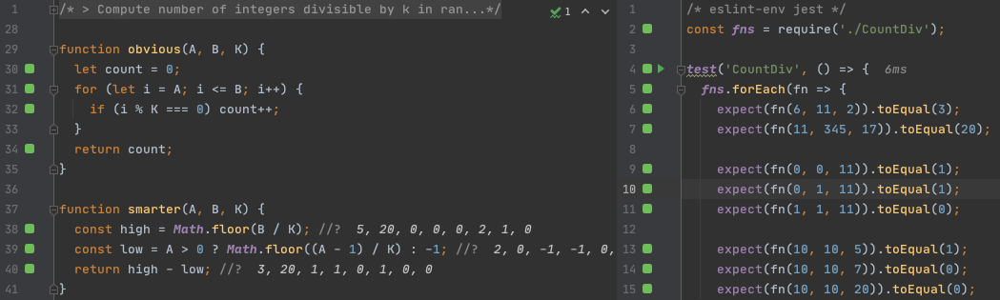

# Algo exercises

- **Collected & curated assignments** from around the internets
- Written in **JavaScript**
- Tested with **Jest**
- **Multiple solutions**
- Ideal for **exploring TDD tooling**, e.g:
  - WebStorm debugging capabilities
  - [Wallaby.js](https://wallabyjs.com/)
  - [Ponicode](https://ponicode.com/)

**⚠️ BEWARE ⚠️**
Coding exercises should only be used for the joy of solving them.
**Do not use them for hiring purposes!**
Ability to solve artificial quizzes is a horrible indicator of person's real-life coding skills.

### Tips

- *Always* start with **pen & paper**
- Verify:
  - Edge cases on inputs
  - Limitations & assumptions given in assignment
  - Not obvious inputs (e.g. odd number of nodes for function that swaps adjacent nodes)
  - Coercing 0 to false in conditions (`typeof x === 'undefined'` instead of `!x`)
- Optimization
  - Consider which checks are not needed due to input limitations from assignment
  - Consider sorting arrays first
  - Consider real need of all assertions
  - Consider reusing existing data structure instead of creating new ones (e.g. with swapping linked list nodes)
  - Consider recursion
  - When being extra smart, be also extra careful

### Attributions

I'm not the original author of the assignments! I've just:
- collected & curated them
- reformatted them for better readability (subjective!)
- rewritten examples into runnable tests + authored new ones
- authored my own solutions
- collected various other solutions for comparison
- setup repo for plug'n'play experience

🎓 This repo is only for educational purposes  
🙏 I've tried my best to add attributions where they were due.

Original sources:

- https://www.alessiocantarella.it/codility/
- https://codility.com/
- https://www.hackerrank.com/domains/algorithms TODO

### Other repos

- https://github.com/johnmee/codility – Python, exhaustive tests
- https://github.com/Dineshkarthik/codility_training - Python, less verbose, no tests
- https://github.com/Mickey0521/Codility - Java, focus on perf, no tests
- https://github.com/jiqsaw/code-challenges – JavaScript, messy

### Related

- https://coderpad.io
- https://codility.com
- https://www.codewars.com
- https://www.codingame.com - game-y
- https://www.hackerearth.com/for-developers
- https://www.topcoder.com
- https://leetcode.com
  - [YouTube explanations, Java](https://www.youtube.com/playlist?list=PLU_sdQYzUj2keVENTP0a5rdykRSgg9Wp-)
  - [YouTube explanations, JavaScript](https://www.youtube.com/channel/UCg-JwDhXFt79VFM902xfmhw/videos)
- https://www.hackerrank.com

